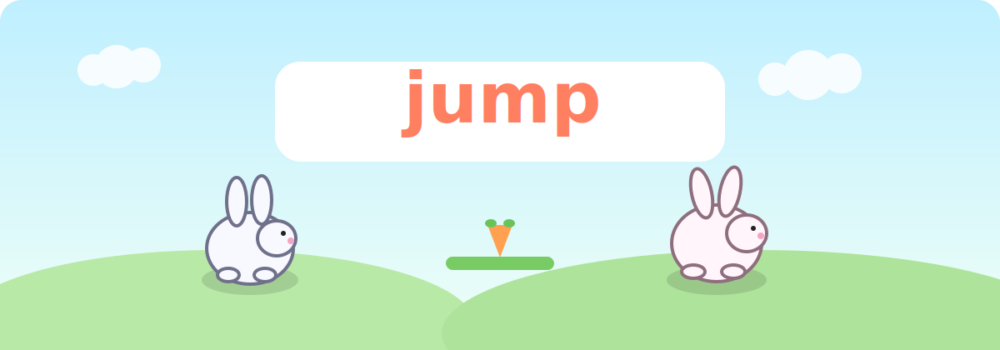

# jump



A fluffy local multiplayer rabbit brawler for the browser.

## What Is This?

`jump` is a 2D cartoon platform game where up to 4 rabbits battle for points.

- Stomp another rabbit's head: `+1 point`
- Eat carrots: `3 carrots = +1 point`
- Win by reaching `10 points` or by leading when the `3:00` timer ends

## Controls

### Keyboard

- Player 1: `A` `D` `W`
- Player 2: `←` `→` `↑`
- Player 3: `J` `L` `I`
- Player 4: `F` `H` `T`

### Gamepad

- Left stick / D-pad: move
- `A` / south button: jump
- Title screen: `A` ready, `B` unready

## Features

- Local multiplayer for up to 4 players
- Bots can replace missing players
- Ready/unready lobby screen
- Randomly selected airy arena each match
- Carrot spawn animation and channeling collection mechanic
- End screen with scores and a winner crown
- Cute rabbit art + run/jump animation
- Graphic blood/body-part effects on point-scoring stomps (visual only)

## Run Locally With Python

From the project root, start a static web server:

```bash
python3 -m http.server 8000
```

Then open:

- [http://localhost:8000](http://localhost:8000)

Stop the server with `Ctrl+C`.

## Quick Start

1. Set each slot to `Human`, `Bot`, or `Off`.
2. Ready up players.
3. Hit **Start Match**.
4. Jump. Stomp. Snack. Repeat.

## Tiny Arena Vibe Check

```text
    .-""-.
  .'  _   '.      carrot!
 /   (o)   \        ^
|  .-___-.  |      /|\
| (  rabbit) |      |
 \  '---'  /      / \
  '._   _.'
     ""
```
